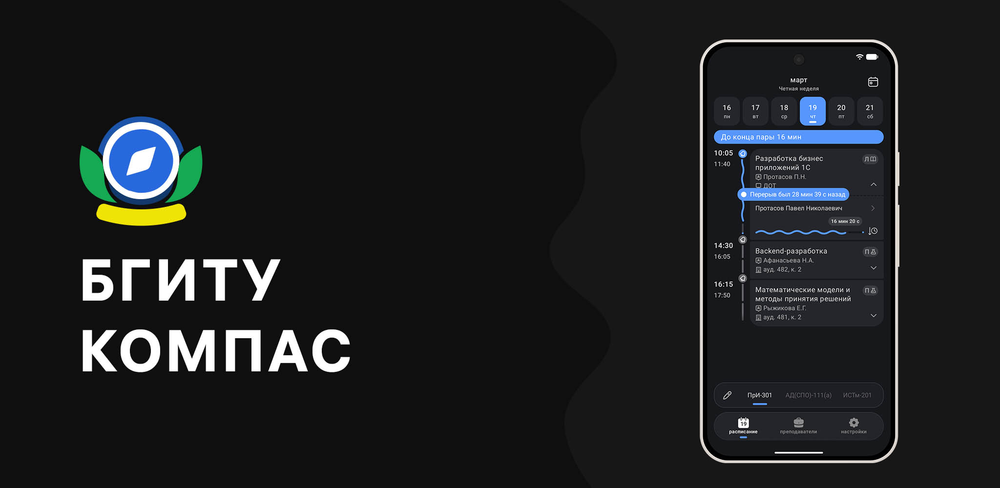
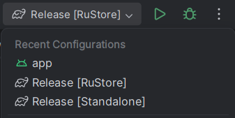

   
                  

БГИТУ Компас
==================

## Сборка и деплой

Приложение поддерживает два типа (Product Flavors) релизных сборок:

1.  **RuStore** — APK для публикации в [RuStore](https://www.rustore.ru/catalog/app/ru.bgitu.app). Механизм обновлений интегрирован с сервисами RuStore.
2.  **Standalone** — независимая версия приложения. Обновления загружаются напрямую с сервера БГИТУ Компас.

### Процесс сборки
Для генерации установочного файла выполните соответствующую Gradle-задачу `assemble[Flavor]Release`. Готовые файлы будут доступны по следующим путям:
*   `\app\build\outputs\apk\rustore\release\`
*   `\app\build\outputs\apk\standalone\release\`

> [!IMPORTANT]
> Перед каждой релизной сборкой необходимо инкрементировать `versionCode` и обновить `versionName` в файле `app/build.gradle.kts`. Это критично для корректной работы механизмов обновления и прохождения модерации в магазинах.

### Требования для сборки и доступа
Для успешной компиляции и функционирования приложения необходимы:
*   **Файлы:**
    *   Ключ подписи: `cert/release.jks`
    *   Конфигурация Google Services: `app/google-services.json`
*   **Доступы:**
    *   Управление проектом в Firebase Console.
    *   Доступ к консоли разработчика RuStore.
    *   API-ключ администратора БГИТУ Компас.

По вопросам получения доступов и ключей: **[@Injent](https://t.me/Injent)**.

---

## Снятие предупреждений Play Protect

При выпуске нового релиза Google Play Protect может помечать APK как «небезопасное приложение». Для снятия этого предупреждения необходимо выполнить процедуру апелляции:

1.  Загрузите файл на [VirusTotal](https://www.virustotal.com/gui/home/upload) и дождитесь окончания сканирования.
2.  Скопируйте **SHA-256** хеш файла.
3.  Заполните [форму апелляции Play Protect](https://support.google.com/googleplay/android-developer/contact/protectappeals?hl=en):
    *   **Email address:** `eliseyfeed@gmail.com`
    *   **Developer name:** `Elisey Verevkin`
    *   **Application package name:** `ru.bgitu.app`
    *   **SHA256 Hash:** `<ваш_хеш>`
    *   **Additional information:** `App doesn't operate sensitive data.`
4.  После отправки формы предупреждение пропадет в течение нескольких часов/дней. Процедура обязательна для каждого нового релиза.

---

## Интеграция с API БГИТУ Компас

Документация API: [api-ssl.bgitu-compass.ru/documentation](https://api-ssl.bgitu-compass.ru/documentation)

### Управление обновлениями (Standalone)
*   **Загрузка файла:** Используйте `POST /update` для деплоя нового APK на сервер.
*   **Публикация обновления:** Для того чтобы пользователи получили уведомление о новой версии, необходимо отправить `POST /remoteConfig`, указав актуальный `versionCode`.
